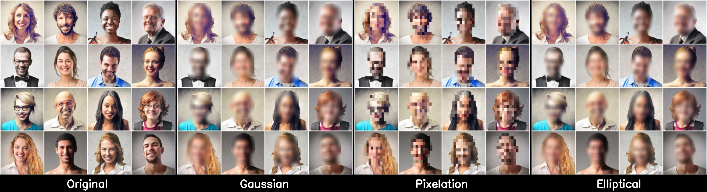

# Blur Daddy

Fast, accurate face blurring for images and videos. Powered by YOLOv8 and MTCNN.



## Features

- **Two detection models**: YOLOv8n-face (fast, default) and MTCNN (accurate, with landmarks)
- **Three blur methods**: Gaussian, pixelation, and elliptical (smooth, natural-looking)
- **Images and video**: Process single files or video streams
- **GPU optional**: Falls back to CPU automatically

## Install

```bash
pip install blur-daddy
```

Or with [uv](https://docs.astral.sh/uv/):

```bash
uv pip install blur-daddy
```

### From source

```bash
git clone https://github.com/AshkiX/blur-daddy.git
cd blur-daddy
uv sync
```

## Quick Start

```bash
# Blur faces in an image
blur-daddy --input photo.jpg --output blurred.jpg

# Blur faces in a video
blur-daddy --input video.mp4 --output blurred.mp4

# Use pixelation instead of gaussian
blur-daddy --input photo.jpg --output blurred.jpg --method pixelation

# Use elliptical blur (smooth, follows face angle)
blur-daddy --input photo.jpg --output blurred.jpg --method elliptical

# Use MTCNN for more accurate detection
blur-daddy --input photo.jpg --output blurred.jpg --model mtcnn
```

## Python API

```python
from blur_daddy.detection import detect_faces_yolo
from blur_daddy.blur import apply_rect_gaussian_blur
from blur_daddy.image import read_image, save_image
import cv2

# Load and detect
image = read_image("photo.jpg")
image_rgb = cv2.cvtColor(image, cv2.COLOR_BGR2RGB)
boxes, confs, _ = detect_faces_yolo(image_rgb)

# Blur and save
if boxes:
    result = apply_rect_gaussian_blur(image, boxes)
    save_image(result, "blurred.jpg")
```

## Blur Methods

| Method | Description | Best for |
|--------|-------------|----------|
| `gaussian` | Rectangular Gaussian blur | Fast, general purpose |
| `pixelation` | Mosaic/pixel block effect | Classic anonymization look |
| `elliptical` | Smooth elliptical blur with feathered edges | Natural-looking, follows face angle via landmarks |

## CLI Reference

```
blur-daddy --input INPUT --output OUTPUT [--method METHOD] [--model MODEL]

Options:
  --input       Path to image or video file (required)
  --output      Output file path (required)
  --method      gaussian (default), pixelation, elliptical
  --model       yolov8n-face (default), mtcnn
```

**Supported formats:**
- Images: PNG, JPG, JPEG, BMP, WebP, TIFF
- Video: MP4, AVI, MOV, MKV, FLV, WMV, WebM

## Docker

```bash
# Build
docker build -t blur-daddy .

# Run
docker run --rm -v $(pwd):/data blur-daddy \
  --input /data/photo.jpg --output /data/blurred.jpg
```

## Performance

Benchmarks on sample image (CPU):

| Operation | Time |
|-----------|------|
| YOLO detection | ~0.3s |
| MTCNN detection | ~0.5s |
| Gaussian blur | <0.01s |
| Pixelation | <0.01s |
| Elliptical blur | ~0.04s |

GPU acceleration available via CUDA — set up PyTorch with CUDA support for faster detection.

## Development

```bash
git clone https://github.com/AshkiX/blur-daddy.git
cd blur-daddy
uv sync

# Run tests
uv run pytest

# Run tests with milestone report
uv run pytest --milestone-report M2

# Lint
uv run ruff check .
```

## License

MIT

## Acknowledgements

Sample video footage used for testing and demonstration purposes is sourced from:
- YouTube: [https://www.youtube.com/watch?v=_ofEQYA2V58](https://www.youtube.com/watch?v=_ofEQYA2V58)
