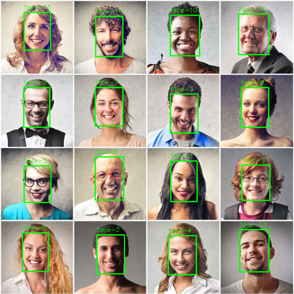

# M2.5 — Milestone Report

**2026-03-28 15:19 UTC** | **ALL PASSING** | 91 total | 91 passed | 0 failed | 0 skipped

## Tests by Module

| Module | Pass | Fail | Skip | Status |
|--------|------|------|------|--------|
| test_api | 33 | 0 | 0 | pass |
| test_benchmark | 4 | 0 | 0 | pass |
| test_blur | 21 | 0 | 0 | pass |
| test_cli | 8 | 0 | 0 | pass |
| test_face_detection | 8 | 0 | 0 | pass |
| test_image | 7 | 0 | 0 | pass |
| test_video | 10 | 0 | 0 | pass |

## Performance

| Operation | Time |
|-----------|------|
| `detect(model='yolov8n-face')` | 0.405s |
| `detect(model='mtcnn')` | 0.805s |
| `blur(method='gaussian')` | 0.200s |
| `blur(method='pixelation')` | 0.286s |
| `blur(method='elliptical')` | 0.243s |
| `blur(keep=[face-0])` | 0.282s |

## Visual Samples

| Original | detect() | blur(method='gaussian') | blur(method='pixelation') | blur(method='elliptical') | blur(keep=[face-0]) |
| --- | --- | --- | --- | --- | --- |
|  |  |  |  |  | ![blur(keep=[face-0])](M2.5/blur_keep.png) |

## Milestone Trend

| Milestone | Total | Passed | Failed |
|-----------|-------|--------|--------|
| M0 | 58 | 58 | 0 |
| M1 | 58 | 58 | 0 |
| M2 | 58 | 58 | 0 |
| M2.5 **<- current** | 91 | 91 | 0 |

---
*Generated by `pytest --milestone-report M2.5`*